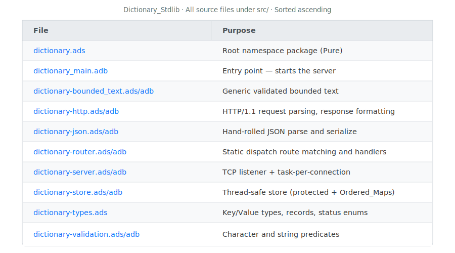

# Dictionary_Stdlib — Ada 2022 REST Microservice

[](LICENSE) [](https://ada-lang.io) [](https://alire.ada.dev)

**Version:** 0.1.0-dev
**SPDX-License-Identifier:** BSD-3-Clause
**Copyright:** (c) 2026 Michael Gardner, A Bit of Help, Inc.

> **Educational Project** — This microservice is a teaching tool for engineers
> learning to build safe, concurrent network services with Ada 2022.
> Production-level features such as TLS, graceful shutdown, persistent storage,
> structured logging, connection pooling, and comprehensive error recovery were
> intentionally omitted to keep the focus on core concepts. See
> [Intentional Simplifications](#intentional-simplifications) for a complete
> list of what was left out and why.

A key-value dictionary exposed as a RESTful HTTP/1.1 service, built
entirely from Ada 2022 standard library packages — **no third-party
crates**. The service parses HTTP from raw TCP sockets, demonstrating
what frameworks abstract away.

## What This Project Teaches

| Concept | Where to Look |
|---------|---------------|
| Generic programming | `dictionary-bounded_text.ads` — one generic, two instantiations |
| Pre/Post contracts | `dictionary-validation.ads` — every public function is contracted |
| Protected objects | `dictionary-store.ads` — concurrent readers, exclusive writers |
| Ada tasking | `dictionary-server.adb` — task-per-connection concurrency |
| TCP socket programming | `dictionary-server.adb` — GNAT.Sockets accept loop |
| HTTP/1.1 wire format | `dictionary-http.adb` — hand-parsed request line, headers, body |
| JSON at the byte level | `dictionary-json.adb` — hand-rolled parse and serialize |
| Bounded types | `dictionary-types.ads` — no heap allocation for domain data |
| Discriminated records | `dictionary-types.ads` — `Entry_Result` as a lightweight Option |
| Static dispatch routing | `dictionary-router.adb` — direct calls, no tagged types |

## Three-Project Roadmap

1. **This project** — standard library only (educational, protocol-level)
2. **Crate-based version** — same API using Ada Web Server + JSON crates
3. **Hybrid enterprise** — full DDD / Clean / Hexagonal architecture

## API Reference

| Method | Path | Purpose | Success | Errors |
|--------|------|---------|---------|--------|
| `POST` | `/entries` | Create an entry | 201 | 400, 409 |
| `GET` | `/entries/{key}` | Retrieve one entry | 200 | 404 |
| `GET` | `/entries` | List all (sorted by key) | 200 | — |
| `PUT` | `/entries/{key}` | Update value (strict) | 200 | 400, 404 |
| `DELETE` | `/entries/{key}` | Remove an entry | 204 | 404 |
| `GET` | `/health` | Health check | 200 | — |

### Key Rules

- `[a-zA-Z0-9-]+`, max 50 characters, **case-insensitive** (stored lowercase)
- Unique — duplicate keys return `409 Conflict`

### Value Rules

- Non-empty printable ASCII (space through tilde), max 200 characters

### Design Decisions

- **No PATCH** — With a single mutable field (value), PATCH and PUT would
  be identical. PUT suffices. This is itself a teaching point: use PATCH
  when a resource has multiple independently updatable fields.
- **PUT is strict update** — Returns 404 if the key does not exist. POST
  is the only way to create entries. This enforces clear REST semantics.
- **Max 100 entries** — The store is bounded to teach resource-limit
  awareness. A production service would use persistent storage.

### Example Usage

```bash
# Health check
curl http://localhost:8080/health

# Create
curl -X POST http://localhost:8080/entries \
  -d '{"key":"hello","value":"A common greeting"}'

# Read
curl http://localhost:8080/entries/hello

# List all (sorted by key ascending)
curl http://localhost:8080/entries

# Update
curl -X PUT http://localhost:8080/entries/hello \
  -d '{"key":"hello","value":"An updated greeting"}'

# Delete
curl -X DELETE http://localhost:8080/entries/hello
```

## Building

### Prerequisites

- Docker with the `dev-container-ada` image running
- The project is mounted at `/workspace/dictionary` inside the container

### Build Commands

All builds happen inside the dev container:

```bash
make build           # Development build
make build-release   # Release build (optimized)
make run             # Build and start the server
make clean           # Clean build artifacts
make rebuild         # Clean + build
make help            # Show all available targets
```

### Docker (Production Image)

```bash
make docker-build    # Multi-stage build (~93 MB image)
make docker-run      # Run on port 8080 (nonroot, read-only)
make docker-stop     # Stop the container
make docker-test     # Build, run, and exercise all endpoints
make docker-clean    # Remove the image
```

Or with docker-compose:

```bash
docker compose up --build     # Build and start
docker compose down           # Stop
```

The production image:
- Runs as nonroot user `app` (UID 10000)
- Uses a read-only root filesystem
- Exposes port 8080
- Includes a health check on `/health`
- Is Kubernetes-ready (use `httpGet` liveness/readiness probes)

## Project Structure



## HTTP-Only Scope

This service uses HTTP, not HTTPS. The Ada standard library and GNAT
runtime do not include TLS support. Adding TLS would require C bindings
to OpenSSL or GnuTLS, or a third-party Ada library — both outside the
scope of a standard-library-only project.

This is an **intentional scope decision**, not a limitation of Ada itself.
Ada can and does bind to TLS libraries in production systems. The
crate-based version of this project will include HTTPS support.

## Intentional Simplifications

This project prioritizes **clarity and learning** over production
readiness. The following are known limitations, not oversights:

| Area | Simplification | Production Alternative |
|------|---------------|----------------------|
| **TLS** | HTTP only | TLS via OpenSSL bindings or Ada Web Server |
| **Concurrency** | Tasks leak memory on termination | Bounded task pool with reuse |
| **Shutdown** | No graceful shutdown; Ctrl+C terminates | Signal handler, drain connections |
| **Timeouts** | No socket read/write timeouts | `SO_RCVTIMEO` / `SO_SNDTIMEO` or `select()` |
| **Keep-alive** | `Connection: close` on every response | HTTP/1.1 persistent connections |
| **Request size** | Fixed 8 KB buffer, no chunked encoding | Streaming parser, chunked transfer |
| **JSON** | Hand-rolled, minimal escape handling | Production JSON library |
| **Persistence** | In-memory only; data lost on restart | Database or file-backed storage |
| **Logging** | Minimal `Text_IO` to stderr | Structured logging with levels |
| **Validation** | Basic character checks | Full URI decoding, content-type negotiation |
| **CORS** | Not implemented | `Access-Control-*` headers |
| **Rate limiting** | Not implemented | Token bucket or sliding window |
| **Error recovery** | Basic exception handler per connection | Circuit breakers, retry logic |

## License

BSD-3-Clause — see LICENSE file.

## AI Assistance & Authorship

This project was developed with AI coding assistance (Claude). All code
was reviewed, tested, and approved by a human developer. The AI served as
a tool to accelerate development — all architectural decisions, design
choices, and final code are the responsibility of the human maintainer.

AI assistants are tools. Humans are accountable.

## Author

Michael Gardner
A Bit of Help, Inc.
